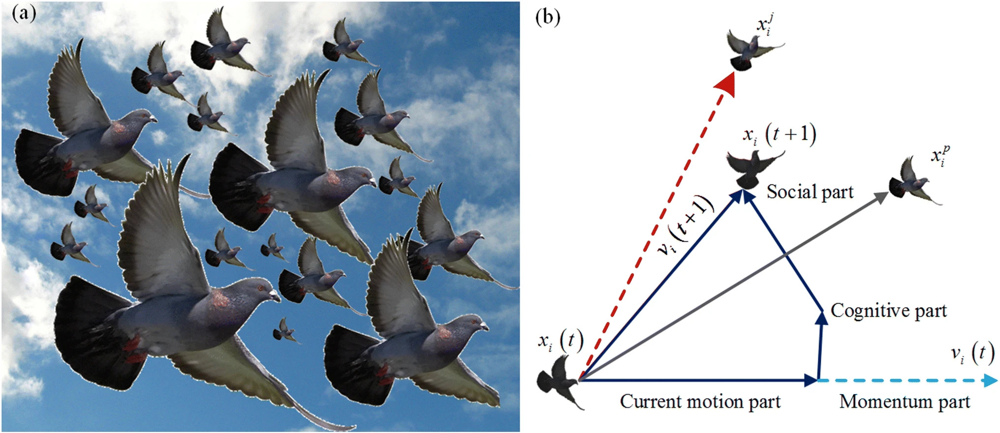
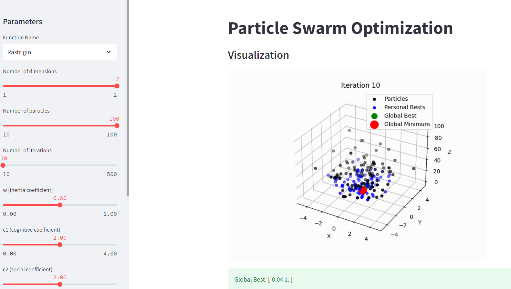

# Particle Swarm Optimization

### Project goal : 
Explore the PSO (Particle Swarm Optimization) Algorithm, including its unique specifications. Understand how it can be applied in various scenarios. Experience it visually through an interactive Streamlit application.

### Project steps :
- Application on SAS
- Writing a dissertation on the subject
- Application on Python
- Deployment on a Streamlit app

### Streamlit app :
https://particleswarmoptimization-i2hpcpo3szscfm3tygzdwt.streamlit.app/

### Python libraries used :
streamlit, imageio, pandas, matplotlib
